# spring cloud 详细用户操作指南

使用华为云 **spring cloud engine 引擎** 用户详细操作指南.

## [登录华为云](https://auth.huaweicloud.com/authui/login?locale=zh-cn&service=https%3A%2F%2Fwww.huaweicloud.com%2F#/login)
> 若您没有 **华为云** 账号,请在注册界面, 注册自己的华为云账号

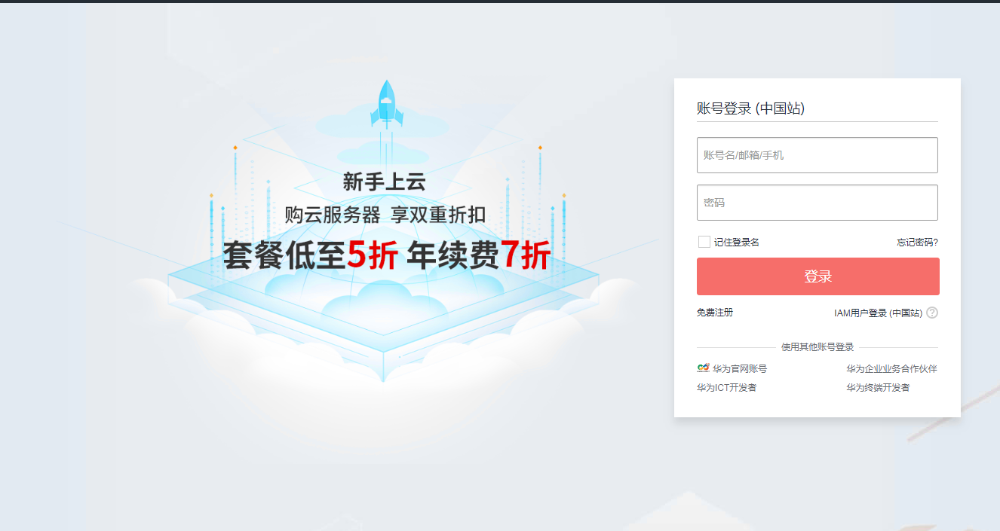

> 选择并点击 **微服务引擎 > 立即使用**

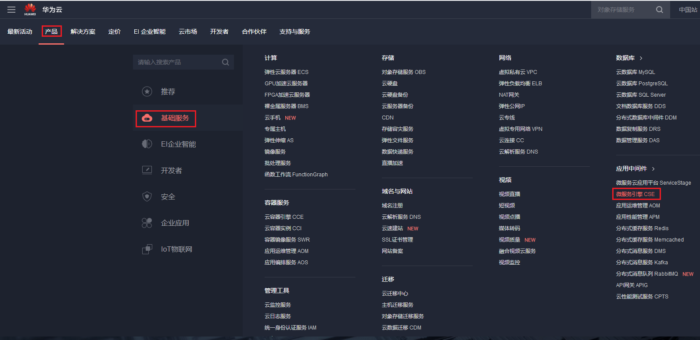

## 购买spring cloud 微服务引擎
> 点击 **购买微服务引擎**, 选择 **SpringCloud引擎专享版**

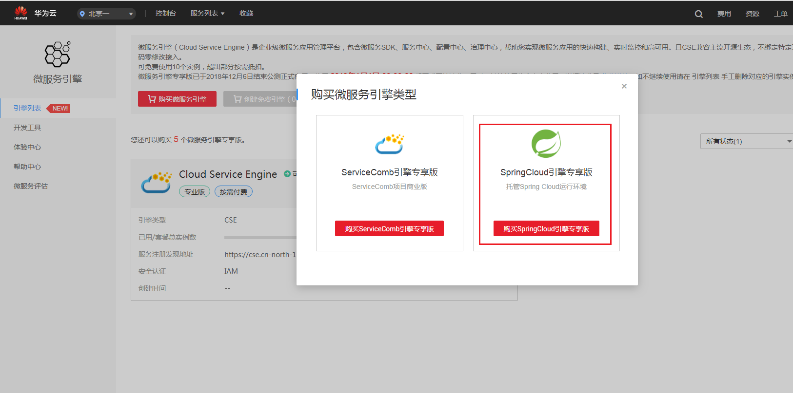

* #### 同时包含组件 **eureka** 和 **config server** .

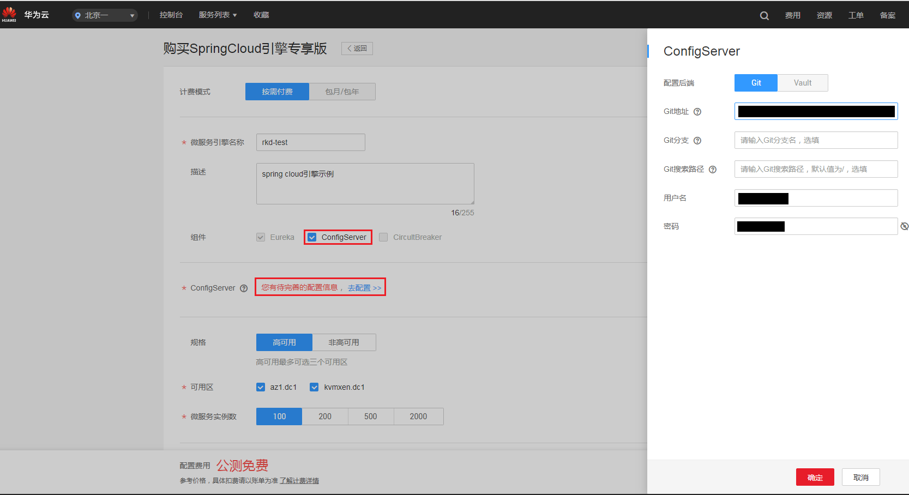

* #### 只包含组件 **eureka** .

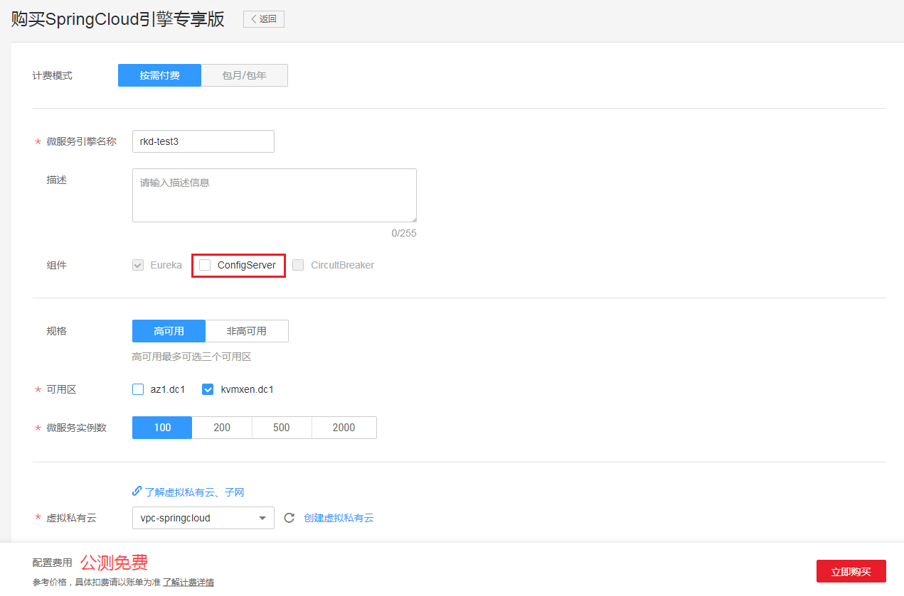


> 进入 **引擎列表** ,查看创建的引擎. **ps:** **高可用引擎** 创建时间大约为 **20 分钟**, 请耐心等待...

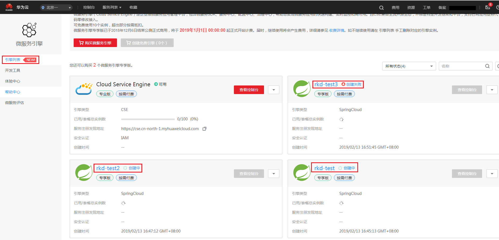

## 接入spring cloud 引擎

* #### 接入**spring cloud eureka** 服务中心
> **spring cloud 引擎** 暂时仅支持同 VPC下 **虚拟机或者 CCE 集群**访问

* 创建 **`同VPC`** 下虚拟机 或者CCE 集群.
* 复制以下 **服务注册发现地址** , 拼接 **/eureka** .. 如下图eureka地址为: **https://192.168.0.57:30115/eureka/**

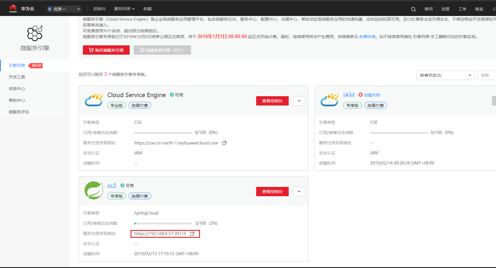

```yaml
eureka:
  client:
    serviceUrl:
      defaultZone: https://192.168.0.57:30115/eureka/ # 这里替换成自己spring cloud 引擎的服务地址
    fetch-registry: false
  instance:
    prefer-ip-address: true

```

* 为了正常使用**https**接入 **eureka 服务中心**. 需要增加以下 配置. [示例项目 demo-engine-provider](demo-engine-provider):

```java
@Configuration
public class WebConfiguration {

    @Bean
    public SSLContext sslContext() throws Exception {
        SSLContext context = SSLContext.getInstance("SSL");
        TrustManager trustManager = new X509TrustManager() {
            @Override
            public void checkClientTrusted(X509Certificate[] x509Certificates, String s)
                    throws CertificateException {

            }

            @Override
            public void checkServerTrusted(X509Certificate[] x509Certificates, String s)
                    throws CertificateException {

            }

            @Override
            public X509Certificate[] getAcceptedIssuers() {
                return null;
            }
        };
        context.init(null, new TrustManager[] {trustManager}, null);
        return context;
    }
    //参数可以正常适配
    @Bean
    public DiscoveryClientOptionalArgs discoveryClientOptionalArgs(SSLContext sslContext) {
        DiscoveryClientOptionalArgs args = new DiscoveryClientOptionalArgs();
        EurekaJerseyClientBuilder builder = new EurekaJerseyClientBuilder();
        builder.withClientName("HW-Eureka-PROVIDER")
                .withMaxTotalConnections(10)
                .withMaxConnectionsPerHost(10)
                .withCustomSSL(sslContext)
                .withHostnameVerifier((s, sslSession) -> true);
        args.setEurekaJerseyClient(builder.build());
        return args;
    }
}
```

* 为了正常使用 **https** 接入**config server**,需要增加以下配置. [示例项目: demo-config](demo-config)

 1 . pom文件增加 **httpclient** 依赖

```xml
        <dependency>
            <groupId>org.apache.httpcomponents</groupId>
            <artifactId>httpclient</artifactId>
            <version>4.5.7</version>
        </dependency>
```
2 . 增加全局配置 **WebConfiguration**

```java
@Configuration
public class WebConfiguration {
    @Bean
    public SSLContext sslContext() throws Exception {
        SSLContext context = SSLContext.getInstance("SSL");
        TrustManager trustManager = new X509TrustManager() {
            @Override
            public void checkClientTrusted(X509Certificate[] x509Certificates, String s)
                    throws CertificateException {

            }

            @Override
            public void checkServerTrusted(X509Certificate[] x509Certificates, String s)
                    throws CertificateException {

            }

            @Override
            public X509Certificate[] getAcceptedIssuers() {
                return null;
            }
        };
        context.init(null, new TrustManager[]{trustManager}, null);
        return context;
    }

    @Bean
    public ConfigServicePropertySourceLocator configServicePropertySourceLocator(SSLContext sslContext, ConfigClientProperties configClientProperties) {
        ConfigServicePropertySourceLocator configServicePropertySourceLocator = new ConfigServicePropertySourceLocator(configClientProperties);
        SSLConnectionSocketFactory csf = new SSLConnectionSocketFactory(sslContext, (s, sslSession) -> true);
        CloseableHttpClient httpClient = HttpClients.custom()
                .setSSLSocketFactory(csf)
                .setSSLHostnameVerifier((s, sslSession) -> true)
                .build();
        HttpComponentsClientHttpRequestFactory requestFactory =
                new HttpComponentsClientHttpRequestFactory();
        requestFactory.setHttpClient(httpClient);

        RestTemplate restTemplate = new RestTemplate(requestFactory);
        configServicePropertySourceLocator.setRestTemplate(restTemplate);
        return configServicePropertySourceLocator;
    }
}
```

3 . **resources/META-INF** 文件夹增加 **spring.factories** 文件

```
org.springframework.cloud.bootstrap.BootstrapConfiguration=\
com.huawei.democonfig.config.WebConfiguration
```
 
4 . 修改 **bootstrap.yaml** 文件

```yaml
server:
  port: 8991
spring:
  application:
    name: config-client-only
  cloud:
    config:
      label: master
      profile: dev
      uri: http://localhost:8888/ # config server uri . 该地址可以从下图中查找
      name: name

```
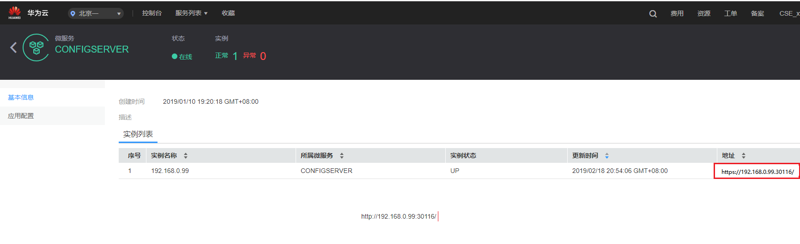

* 通过**服务发现**的方式 使用**config server**. 需要做以下配置. [示例项目: demo-config-eureka](demo-config-eureka)


 1 . pom文件增加 **httpclient** 依赖

```xml
        <dependency>
            <groupId>org.apache.httpcomponents</groupId>
            <artifactId>httpclient</artifactId>
            <version>4.5.7</version>
        </dependency>
```
2 . 增加全局配置 **WebConfiguration**

```java
@Configuration
public class WebConfiguration {
 
    @Bean
    public SSLContext sslContext() throws Exception {
        SSLContext context = SSLContext.getInstance("SSL");
        TrustManager trustManager = new X509TrustManager() {
            @Override
            public void checkClientTrusted(X509Certificate[] x509Certificates, String s)
                    throws CertificateException {
 
            }
 
            @Override
            public void checkServerTrusted(X509Certificate[] x509Certificates, String s)
                    throws CertificateException {
 
            }
 
            @Override
            public X509Certificate[] getAcceptedIssuers() {
                return null;
            }
        };
        context.init(null, new TrustManager[]{trustManager}, null);
        return context;
    }
 
    @Bean
    public DiscoveryClientOptionalArgs discoveryClientOptionalArgs(SSLContext sslContext) {
        DiscoveryClientOptionalArgs args = new DiscoveryClientOptionalArgs();
        EurekaJerseyClientBuilder builder = new EurekaJerseyClientBuilder();
        builder.withClientName("HW-Eureka-PROVIDER")
                .withMaxTotalConnections(10)
                .withMaxConnectionsPerHost(10)
                .withCustomSSL(sslContext)
                .withHostnameVerifier((s, sslSession) -> true);
        args.setEurekaJerseyClient(builder.build());
        return args;
    }
 
    @Bean
    public ConfigServicePropertySourceLocator configServicePropertySourceLocator(SSLContext sslContext, ConfigClientProperties configClientProperties) {
        ConfigServicePropertySourceLocator configServicePropertySourceLocator = new ConfigServicePropertySourceLocator(configClientProperties);
        SSLConnectionSocketFactory csf = new SSLConnectionSocketFactory(sslContext, (s, sslSession) -> true);
        CloseableHttpClient httpClient = HttpClients.custom()
                .setSSLSocketFactory(csf)
                .setSSLHostnameVerifier((s, sslSession) -> true)
                .build();
        HttpComponentsClientHttpRequestFactory requestFactory =
                new HttpComponentsClientHttpRequestFactory();
        requestFactory.setHttpClient(httpClient);
 
        RestTemplate restTemplate = new RestTemplate(requestFactory);
        configServicePropertySourceLocator.setRestTemplate(restTemplate);
        return configServicePropertySourceLocator;
    }
}
```

3 . **resources/META-INF** 文件夹增加 **spring.factories** 文件

```
org.springframework.cloud.bootstrap.BootstrapConfiguration=\
com.configserver.democonfigeureka.config.WebConfiguration
```
 
4 . 修改 **bootstrap.yaml** 文件

```yaml
spring:
  application:
    name: rkd-config-client
  cloud:
    config:
      discovery:
        enabled: true
        service-id: CONFIGSERVER #config server 在服务中心的服务名称
      profile: dev
      name: foo
      label: master

eureka:
  client:
    service-url:
      defaultZone: https://192.168.0.99:30115/eureka/ # spring cloud 引擎的服务中心地址
    fetch-registry: true
    register-with-eureka: false

```

## 引擎管理

* #### **创建失败** > **重试&删除**

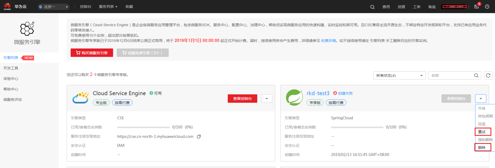

* #### 查看**springcloud**引擎基本配置

> 点击进入 **引擎详细配置**, 可以查看**基本配置**和**服务中心**的连接地址.

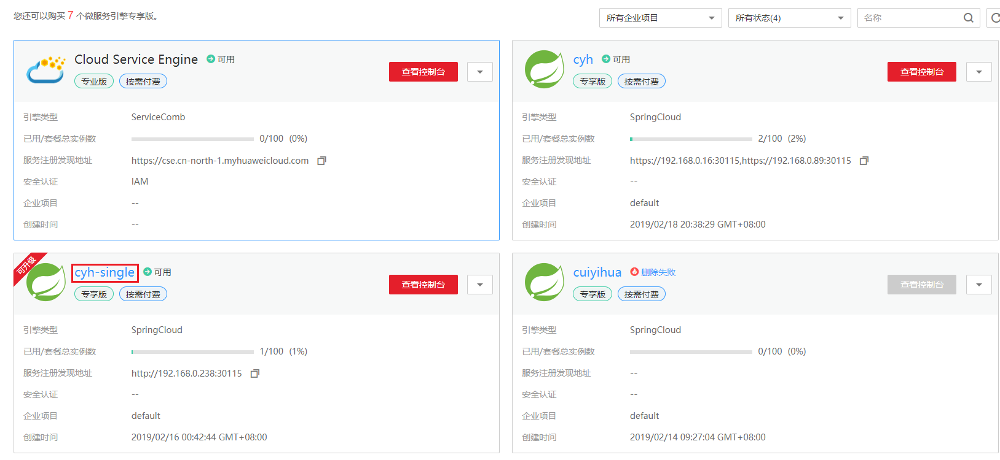

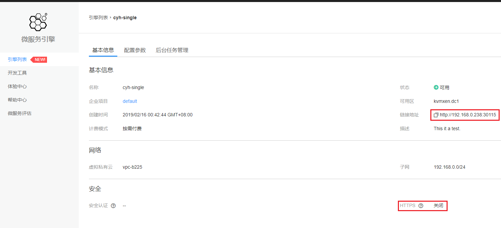

* #### 引擎配置 **变更**.

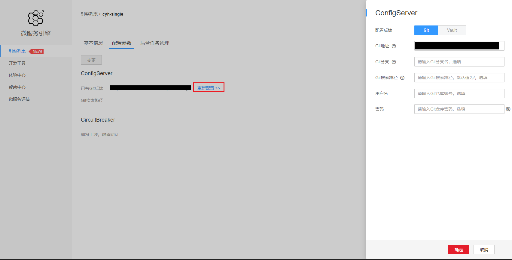

## spring cloud引擎业务应用管理.

* #### 点击 **查看控制台** 进入应用管理界面

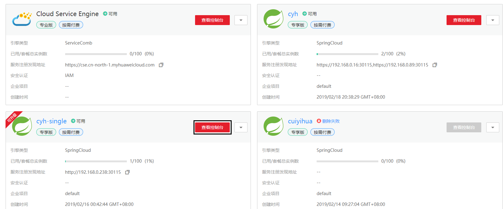

> 进入**微服务引擎服务目录**, 可以查看注册到该 **引擎的所有应用**

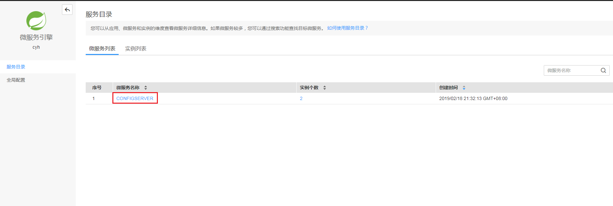

> 点击 **全局配置**, 可以查看到当前**springcloud 引擎** 连接的 config server 中的 **全局配置**, 默认展示 "**dev,test.local**" 三个 profile的全局配置. 要想查看 **自定义 profile**的全局配置, 可以自行**搜索**. 

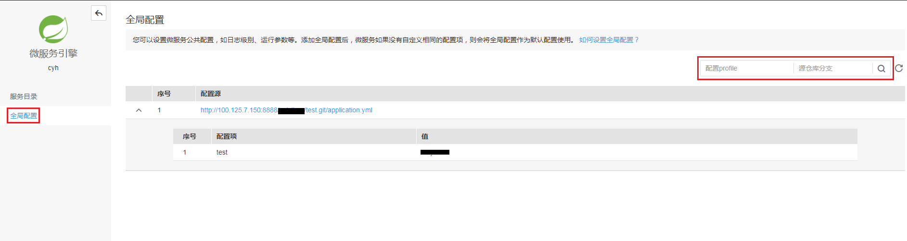

> 点击某个**应用**, 可以进入该应用的**详情界面**

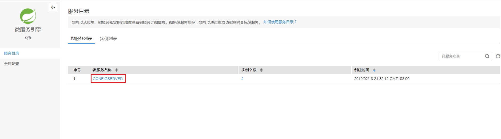

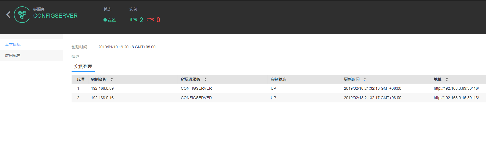

> 点击**应用配置** , 查看该应用从 **config server** 拉取的**详细配置**. 默认显示的是 **master 分支**该应用的配置. 要查看其他自定义分支的配置, 可以自行**搜索**.

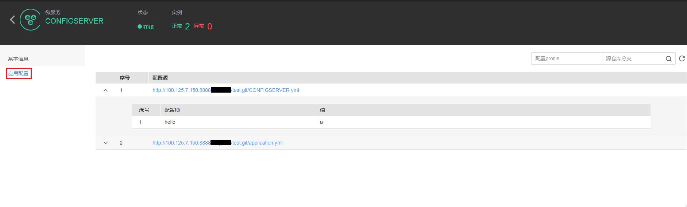